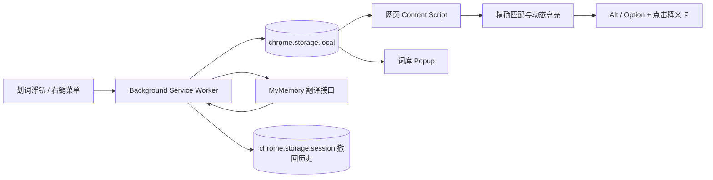

# 拾词 Shici · 网页生词荧光笔

[](LICENSE)
[](manifest.json)
[](https://www.microsoft.com/edge)

在网页里捡起生词，让它在下一次出现时自己发光。

选中 `serendipity`，点击“保存并高亮”。此后它再次出现在网页中时，会被你选择的荧光笔颜色标出；按住 `Alt`（macOS 为 `Option`）点击，高亮旁边就会显示中文“意外发现”。不再需要这个词时，可以在释义卡或词库中直接移除，误操作也能撤回。

**English:** A lightweight Manifest V3 extension for Microsoft Edge that saves unfamiliar English words, highlights future occurrences, and shows cached Chinese translations with Alt/Option-click.

## 功能

| 功能 | 行为 |
| --- | --- |
| 划词保存 | 选中完整英文单词后，点击浮出的“保存并高亮” |
| 右键保存 | 从网页右键菜单把所选单词加入词库 |
| 跨网页高亮 | 已保存单词在之后访问的普通网页中自动标注 |
| 自定义颜色 | 选择任意荧光笔颜色，并同时预览浅色页面深色字与深色页面白色字的效果 |
| 精确匹配 | 不区分大小写，只匹配完整单词；保存 `cat` 不会误标 `category` |
| 网站优先交互 | 普通点击仍由网页处理，只有 `Alt` / `Option` + 点击才打开中文释义 |
| 动态页面支持 | 新插入的 SPA、无限滚动内容会被增量处理 |
| 词库管理 | 添加、搜索、修改翻译、重试翻译、删除或清空词条，并支持撤回与重做 |
| 常用快捷键 | 支持撤回、重做、搜索、关闭面板、开关高亮和打开弹窗 |
| 一键暂停 | 暂停所有网页高亮而不删除词库 |

词库保存在 Edge 的扩展本地存储中。除自动翻译所需的英文单词外，扩展不会上传网页正文或来源地址。

## 安装

目前项目通过 Edge 开发人员模式侧载，不需要构建，也不需要安装依赖。

### 1. 获取源码

```bash
git clone https://github.com/segujushi-lang/shici-edge-vocab-highlighter.git
cd shici-edge-vocab-highlighter
```

也可以在 GitHub 仓库页面选择 **Code → Download ZIP**，解压后继续下一步。

### 2. 加载扩展

1. 在 Edge 地址栏打开 `edge://extensions/`。
2. 打开左侧的“开发人员模式”。
3. 点击“加载解压缩的扩展”。
4. 选择包含 `manifest.json` 的项目目录。
5. 在扩展菜单中把“拾词”固定到工具栏。

首次安装或更新代码后，请刷新已经打开的网页，使内容脚本生效。

## 使用

### 保存生词

在网页中选中一个完整的英文单词，然后点击选区附近的“保存并高亮”。也可以右键选区，选择“保存‘…’并高亮”。

扩展会立即保存这个词，并在后台请求中文翻译。即使翻译服务暂时不可用，单词仍会留在词库中，稍后可以重试或手工填写释义。

### 查看或移除

按住 `Alt`（macOS 为 `Option`）并点击高亮即可打开释义卡。释义卡显示英文原词和中文翻译，并提供“移出词库”按钮。移除后，当前页面上的对应高亮会立即消失，之后的网页也不再标注。

普通点击、链接跳转和网页自己的点击处理都不会被扩展截获。只有明确按下 `Alt` / `Option` 的点击手势会交给拾词，因此不会打乱网站原本的操作逻辑。

### 管理词库

点击 Edge 工具栏中的“拾词”可以：

- 手工添加英文单词和中文释义；
- 按英文或中文搜索词库；
- 修改不准确的翻译；
- 重新请求自动翻译；
- 删除单个词条或清空词库；
- 撤回或重做最近的词库、颜色及高亮开关操作；
- 暂停、恢复全部网页高亮。

### 快捷键

拾词沿用常见的软件操作习惯。输入框获得焦点时，撤回和重做仍归输入框本身处理，不会误改词库。

| 使用位置 | 快捷键 | 行为 |
| --- | --- | --- |
| 网页 | `Alt` / `Option` + 点击 | 查看高亮单词释义 |
| 拾词弹窗 | `Ctrl` / `Command` + `Z` | 撤回最近一次插件操作 |
| 拾词弹窗 | `Ctrl` + `Y` 或 `Command` + `Shift` + `Z` | 重做 |
| 拾词弹窗 | `/` | 聚焦词库搜索 |
| 拾词弹窗 | `Esc` | 清除搜索或关闭编辑面板 |
| 浏览器全局 | `Alt` / `Option` + `Shift` + `S` | 打开拾词弹窗 |
| 浏览器全局 | `Alt` / `Option` + `Shift` + `H` | 暂停或恢复网页高亮 |
| 浏览器全局 | `Alt` / `Option` + `Shift` + `Z` | 撤回最近一次插件操作 |
| 浏览器全局 | `Alt` / `Option` + `Shift` + `Y` | 重做 |

弹窗底部的“快捷键”会显示浏览器实际注册的组合键。若某个组合键已被系统或其他扩展占用，可在 `edge://extensions/shortcuts` 中重新指定。撤回历史最多保留 20 步，并随当前浏览器会话结束而清除。

### 调整高亮颜色

点击 Edge 工具栏中的“拾词”，在顶部“荧光笔颜色”区域打开颜色选择器。旁边的双预览会同时显示浅色页面的深色文字和深色页面的白色文字，方便判断两种主题下的可读性。选中的颜色会保存在本机，并立即应用到所有已打开网页中的高亮；之后访问的网页也会继续使用该颜色。点击“默认”可恢复初始黄色 `#FFDD57`。

## 工作原理



- `background.js` 统一处理词库写入、右键菜单、快捷键、会话级撤回历史和跨域翻译请求。
- `content.js` 遍历可安全修改的文本节点，并用 `MutationObserver` 处理后续加入的内容。
- `popup.js` 提供词库的增删改查、高亮开关和颜色选择。
- `shared.js` 负责单词规范化、边界匹配、设置校验、持久化数据清洗和翻译文本解码。
- `chrome.storage.onChanged` 把词库与颜色设置同步到已打开的网页。

高亮会跳过输入框、可编辑区域、代码块、脚本、样式、SVG 和 MathML，尽量不改变网页原有交互。

## 权限与隐私

| 权限或访问范围 | 用途 |
| --- | --- |
| `storage` | 在本机保存词库、翻译、启用状态、高亮颜色和当前会话的撤回历史 |
| `contextMenus` | 提供“保存并高亮”右键菜单 |
| `http://*/*`、`https://*/*` | 在普通网页中识别并高亮已保存单词 |
| `api.mymemory.translated.net` | 仅在需要自动翻译时发送英文单词 |

扩展没有自建服务器，不收集账号、浏览历史、表单内容或网页正文。来源页面地址只保存在本地，不会发送给翻译服务。完整说明见 [PRIVACY.md](PRIVACY.md)。

## 开发与测试

运行时零依赖；测试使用 Node.js 内置测试运行器。

```bash
npm test
npm run check
```

当前自动化检查覆盖：

- Manifest V3 与所需权限；
- Manifest 引用文件完整性；
- HTTP/HTTPS 内容脚本匹配范围；
- 大小写归一化、连字符和撇号单词；
- 完整单词边界与最长匹配；
- 持久化词条清洗；
- 高亮颜色设置校验、默认值回退与 RGB 转换；
- 浏览器快捷键清单、网站优先点击手势及弹窗快捷键；
- 不暴露历史快照的撤回/重做状态摘要；
- HTML 实体解码与中文结果识别；
- 四个 JavaScript 入口的语法检查。

项目还在隔离的 Microsoft Edge 实例中验证过划词保存、自动翻译、动态 DOM、网站原生点击、按键查看释义、词库添加/删除、撤回/重做以及暂停/恢复。

## 项目结构

```text
.
├── manifest.json          # Edge Manifest V3 声明
├── background.js          # 右键菜单、存储和翻译请求
├── content.js             # 划词按钮、高亮和释义卡
├── content.css            # 网页荧光笔样式
├── popup.html             # 词库管理界面
├── popup.css
├── popup.js
├── shared.js              # 共享的数据与匹配工具
├── tests/                 # 零依赖测试和浏览器夹具
├── PRIVACY.md             # 隐私说明
└── LICENSE                # MIT License
```

## 已知限制

- 浏览器安全规则禁止扩展注入 `edge://` 页面、扩展商店等受保护页面。
- 新单词的自动翻译需要网络；已经缓存的翻译可离线查看。
- 免费翻译可能缺少特定语境，可在词库中手工修正。
- 当前经过完整验证的目标浏览器是 Microsoft Edge；其他 Chromium 浏览器可能兼容，但不在现有测试范围内。

## 参与贡献

欢迎提交错误报告、功能建议和 Pull Request。

1. Fork 本仓库并创建功能分支。
2. 修改后运行 `npm test` 和 `npm run check`。
3. 在 Pull Request 中说明用户可见的变化和验证方式。

建议优先保持零构建依赖、最小权限和本地优先的数据边界。

## 许可证

本项目以 [MIT License](LICENSE) 开源。你可以使用、复制、修改、合并、发布和分发本项目，但需要保留原始版权与许可声明。

自动翻译由 [MyMemory](https://mymemory.translated.net/) 提供，其服务受 MyMemory 自身条款约束。
