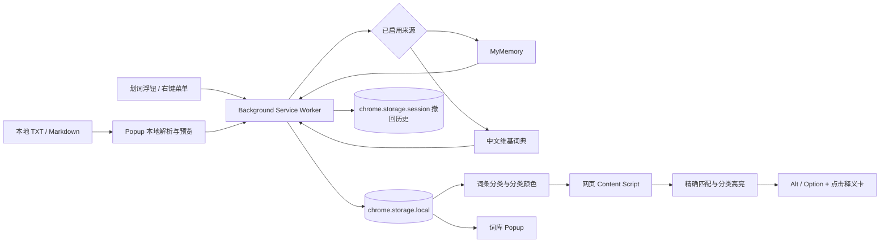

# 拾词 Shici · 网页生词荧光笔

[](LICENSE)
[](manifest.json)
[](https://www.microsoft.com/edge)

在网页里捡起生词，让它在下一次出现时自己发光。

选中 `serendipity`，点击“保存并高亮”。此后它再次出现在网页中时，会被所属分类的荧光笔颜色标出；按住 `Alt`（macOS 为 `Option`）点击，高亮旁边会同时显示“意外发现”“机缘”等带来源标识的中文释义。不再需要这个词时，可以在释义卡或词库中直接移除，误操作也能撤回。

**English:** A lightweight Manifest V3 extension for Microsoft Edge that categorizes unfamiliar English words, highlights each category with its own color, and shows multiple attributed Chinese translations with Alt/Option-click.

## 功能

| 功能 | 行为 |
| --- | --- |
| 划词保存 | 选中完整英文单词后，点击浮出的“保存并高亮” |
| 右键保存 | 从网页右键菜单把所选单词加入词库 |
| 跨网页高亮 | 已保存单词在之后访问的普通网页中自动标注 |
| 分类与颜色 | 创建、改名、换色或删除分类，每个分类使用独立荧光笔颜色 |
| 精确匹配 | 不区分大小写，只匹配完整单词；保存 `cat` 不会误标 `category` |
| 网站优先交互 | 普通点击仍由网页处理，只有 `Alt` / `Option` + 点击才打开中文释义 |
| 动态页面支持 | 新插入的 SPA、无限滚动内容会被增量处理 |
| 文件批量导入 | 从本地 TXT 或 Markdown 文件预览、去重并一次导入最多 500 个生词 |
| 多结果翻译 | 一次显示多条去重后的中文释义，并标注 MyMemory、维基词典、手工或导入来源 |
| 来源选择 | MyMemory 默认开启；中文维基词典由用户明确开启，单个来源失败不影响其他结果 |
| 词库管理 | 添加、分类筛选、移动分类、修改翻译、刷新翻译、删除或清空词条，并支持撤回与重做 |
| 常用快捷键 | 支持撤回、重做、搜索、关闭面板、开关高亮和打开弹窗 |
| 一键暂停 | 暂停所有网页高亮而不删除词库 |

词库保存在 Edge 的扩展本地存储中。除自动翻译所需的英文单词外，扩展不会上传网页正文或来源地址。

## 安装

目前项目通过 Edge 开发人员模式侧载，不需要构建，也不需要安装依赖。

### 1. 获取源码

```bash
git clone https://github.com/segujushi-lang/shici-edge-vocab-highlighter.git
cd shici-edge-vocab-highlighter
```

也可以在 GitHub 仓库页面选择 **Code → Download ZIP**，解压后继续下一步。

### 2. 加载扩展

1. 在 Edge 地址栏打开 `edge://extensions/`。
2. 打开左侧的“开发人员模式”。
3. 点击“加载解压缩的扩展”。
4. 选择包含 `manifest.json` 的项目目录。
5. 在扩展菜单中把“拾词”固定到工具栏。

首次安装或更新代码后，请刷新已经打开的网页，使内容脚本生效。

## 使用

### 保存生词

在网页中选中一个完整的英文单词，然后点击选区附近的“保存并高亮”。也可以右键选区，选择“保存‘…’并高亮”。

扩展会立即保存这个词，并在后台向已启用的来源请求中文翻译。同一来源返回的多个候选和不同来源的释义会去重后一起缓存；即使某个服务暂时不可用，其他来源仍可正常显示，单词也会留在词库中供稍后刷新或手工填写。

### 查看或移除

按住 `Alt`（macOS 为 `Option`）并点击高亮即可打开释义卡。释义卡显示英文原词、分类以及多条带来源标签的中文释义，并提供“刷新翻译”和“移出词库”按钮。移除后，当前页面上的对应高亮会立即消失，之后的网页也不再标注。

普通点击、链接跳转和网页自己的点击处理都不会被扩展截获。只有明确按下 `Alt` / `Option` 的点击手势会交给拾词，因此不会打乱网站原本的操作逻辑。

### 管理词库

点击 Edge 工具栏中的“拾词”可以：

- 手工添加英文单词和中文释义；
- 从 TXT 或 Markdown 文件批量导入生词；
- 创建、改名和删除分类，并为各分类选择颜色；
- 开启或关闭各个自动翻译来源；
- 按英文、中文或分类名搜索，并按分类筛选词库；
- 把单个生词移动到其他分类；
- 修改不准确的翻译；
- 刷新多来源自动翻译；
- 删除单个词条或清空词库；
- 撤回或重做最近的词库、颜色及高亮开关操作；
- 暂停、恢复全部网页高亮。

### 批量导入 TXT / Markdown

在“添加生词”区域点击“导入 TXT / MD”，选择不超过 1 MiB 的 `.txt` 或 `.md` 文件。拾词会先在本机解析文件并显示预览；选择目标分类并确认后，一次最多导入 500 个不重复的有效英文单词。

最简单的格式是每行一个单词，也可以在同一行附带中文释义：

```text
serendipity
curious - 好奇的
insight: 洞见

| word | translation |
| --- | --- |
| epiphany | 顿悟 |
```

同时支持 Markdown 无序列表、有序列表、复选框和表格，以及 Tab、逗号、等号、冒号、箭头等常见分隔符。空行、以 `#` 开头的行、分隔线和代码块会被忽略；无法识别的行会在预览中统计但不会导入。文件内重复单词按大小写合并，词库中已经存在的单词会跳过，不覆盖你修正过的翻译。

文件内容不会上传。未附中文释义的单词仍会保存并高亮，但导入时不会自动发送给翻译服务；只有你之后主动点击该词条的“刷新翻译”，才会向当时已启用的来源发送这一个英文单词。整批导入只占一个撤回步骤，按 `Ctrl` / `Command` + `Z` 即可一次撤销。

### 快捷键

拾词沿用常见的软件操作习惯。输入框获得焦点时，撤回和重做仍归输入框本身处理，不会误改词库。

| 使用位置 | 快捷键 | 行为 |
| --- | --- | --- |
| 网页 | `Alt` / `Option` + 点击 | 查看高亮单词释义 |
| 拾词弹窗 | `Ctrl` / `Command` + `Z` | 撤回最近一次插件操作 |
| 拾词弹窗 | `Ctrl` + `Y` 或 `Command` + `Shift` + `Z` | 重做 |
| 拾词弹窗 | `/` | 聚焦词库搜索 |
| 拾词弹窗 | `Esc` | 清除搜索或关闭编辑面板 |
| 浏览器全局 | `Alt` / `Option` + `Shift` + `S` | 打开拾词弹窗 |
| 浏览器全局 | `Alt` / `Option` + `Shift` + `H` | 暂停或恢复网页高亮 |
| 浏览器全局 | `Alt` / `Option` + `Shift` + `Z` | 撤回最近一次插件操作 |
| 浏览器全局 | `Alt` / `Option` + `Shift` + `Y` | 重做 |

弹窗底部的“快捷键”会显示浏览器实际注册的组合键。若某个组合键已被系统或其他扩展占用，可在 `edge://extensions/shortcuts` 中重新指定。撤回历史最多保留 20 步，并随当前浏览器会话结束而清除。

### 分类与高亮颜色

点击 Edge 工具栏中的“拾词”，在顶部“分类与颜色”区域可以管理最多 20 个分类。选择分类后可以改名、调整颜色或新建分类；双预览会同时显示浅色页面的深色文字和深色页面的白色文字，方便判断可读性。

手工添加和批量导入时可以直接指定分类。网页划词或右键保存的新词先进入“默认分类”，之后可在词条卡片的分类选择器中移动。修改分类颜色或移动单词会立即更新所有已打开网页中的对应高亮，无需刷新。

默认分类不能删除，但可以改名和换色。删除其他分类时，其中的生词会安全移回默认分类，不会被删除；这项操作以及新建、改名、换色和移动都可以撤回。升级自旧版本时，已有生词自动进入默认分类，原来的全局高亮颜色会保留为默认分类颜色。

### 多来源翻译

弹窗的“翻译来源”区域可以分别控制 MyMemory 和中文维基词典：

- **MyMemory** 默认开启，一次请求可保存最多 3 条去重后的翻译候选；
- **中文维基词典** 默认关闭，明确开启后会补充最多 4 条按词性标注的中文义项；
- 两个来源并发查询并独立容错，最后合并为最多 8 条结果；
- 手工修改的释义始终置顶，刷新自动翻译不会覆盖它；
- 从旧版本升级后，已有单条翻译显示为“已有释义”，不会自动向新增来源发送。可点击词条的刷新按钮主动补齐新结果。

开启某个来源只改变之后的自动翻译或主动刷新行为，不会立刻上传整个词库。请求只包含当前单个英文词，不包含网页正文、页面地址、分类或本地文件内容。来源开关本身也可撤回和重做。

## 工作原理



- `background.js` 统一处理词库写入、分类管理、批量导入、右键菜单、快捷键、会话级撤回历史和跨域翻译请求。
- `content.js` 遍历可安全修改的文本节点，按词条分类设置颜色，并用 `MutationObserver` 处理后续加入的内容。
- `popup.js` 提供分类管理、翻译来源开关、词库的增删改查、文件导入预览、高亮开关和分类颜色选择。
- `shared.js` 负责单词与分类规范化、旧数据迁移、批量文件解析、边界匹配、多来源结果清洗去重和维基词典义项提取。
- `chrome.storage.onChanged` 把词库、分类与颜色设置同步到已打开的网页。

高亮会跳过输入框、可编辑区域、代码块、脚本、样式、SVG 和 MathML，尽量不改变网页原有交互。

## 权限与隐私

| 权限或访问范围 | 用途 |
| --- | --- |
| `storage` | 在本机保存词库、翻译、分类、分类颜色、启用状态和当前会话的撤回历史 |
| `contextMenus` | 提供“保存并高亮”右键菜单 |
| `http://*/*`、`https://*/*` | 在普通网页中识别并高亮已保存单词 |
| `api.mymemory.translated.net` | 仅在 MyMemory 已开启且需要自动翻译时发送当前英文单词 |
| `zh.wiktionary.org` | 仅在用户已开启中文维基词典且需要自动翻译时发送当前英文单词 |

选择本地 TXT/Markdown 文件不需要额外浏览器权限。文件只在弹窗内解析，不会上传；批量导入中缺少释义的单词也不会自动外发。新增的中文维基词典来源默认关闭，必须由用户明确开启。扩展没有自建服务器，不收集账号、浏览历史、表单内容或网页正文。来源页面地址只保存在本地，不会发送给翻译服务。完整说明见 [PRIVACY.md](PRIVACY.md)。

## 开发与测试

运行时零依赖；测试使用 Node.js 内置测试运行器。

```bash
npm test
npm run check
```

当前自动化检查覆盖：

- Manifest V3 与所需权限；
- Manifest 引用文件完整性；
- HTTP/HTTPS 内容脚本匹配范围；
- 大小写归一化、连字符和撇号单词；
- 完整单词边界与最长匹配；
- 持久化词条清洗；
- 旧单条翻译向多结果结构的迁移、来源优先级、去重和数量限制；
- MyMemory 多候选、维基词典词性义项提取、用户来源开关与单源失败隔离；
- 旧词库迁移、分类清洗、无效分类引用修复和分类颜色解析；
- 分类新建、改名、换色、删除、词条移动以及对应的撤回与重做；
- TXT/Markdown 列表、表格和常见分隔符解析，大小写去重及数量限制；
- 批量导入跳过已有词条、全程不发起网络请求，并支持整批撤回与重做；
- 高亮颜色设置校验、默认值回退与 RGB 转换；
- 浏览器快捷键清单、网站优先点击手势及弹窗快捷键；
- 不暴露历史快照的撤回/重做状态摘要；
- HTML 实体解码与中文结果识别；
- 四个 JavaScript 入口的语法检查。

项目还在隔离的 Microsoft Edge 实例中验证过划词保存、多来源翻译与来源开关、动态 DOM、网站原生点击、按键查看多条释义、分类管理与筛选、同页多分类颜色、分类改色与词条移动即时同步、词库添加/删除、TXT/Markdown 导入预览与确认、撤回/重做以及暂停/恢复。

## 项目结构

```text
.
├── manifest.json          # Edge Manifest V3 声明
├── background.js          # 右键菜单、存储和翻译请求
├── content.js             # 划词按钮、高亮和释义卡
├── content.css            # 网页荧光笔样式
├── popup.html             # 词库管理界面
├── popup.css
├── popup.js
├── shared.js              # 共享的数据与匹配工具
├── tests/                 # 零依赖测试和浏览器夹具
├── PRIVACY.md             # 隐私说明
└── LICENSE                # MIT License
```

## 已知限制

- 浏览器安全规则禁止扩展注入 `edge://` 页面、扩展商店等受保护页面。
- 新单词的自动翻译需要网络；已经缓存的翻译可离线查看。
- 免费翻译可能缺少特定语境，可在词库中手工修正。
- 当前经过完整验证的目标浏览器是 Microsoft Edge；其他 Chromium 浏览器可能兼容，但不在现有测试范围内。

## 参与贡献

欢迎提交错误报告、功能建议和 Pull Request。

1. Fork 本仓库并创建功能分支。
2. 修改后运行 `npm test` 和 `npm run check`。
3. 在 Pull Request 中说明用户可见的变化和验证方式。

建议优先保持零构建依赖、最小权限和本地优先的数据边界。

## 许可证

本项目以 [MIT License](LICENSE) 开源。你可以使用、复制、修改、合并、发布和分发本项目，但需要保留原始版权与许可声明。

自动翻译可由 [MyMemory](https://mymemory.translated.net/) 和用户可选开启的[中文维基词典](https://zh.wiktionary.org/)提供，各服务受其自身条款与隐私政策约束。
